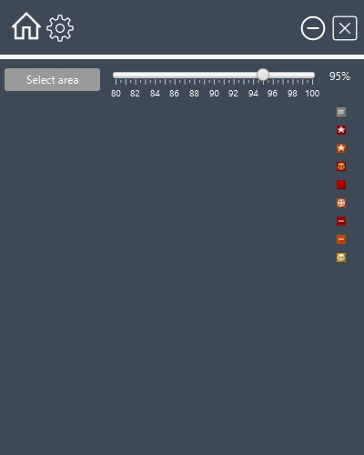
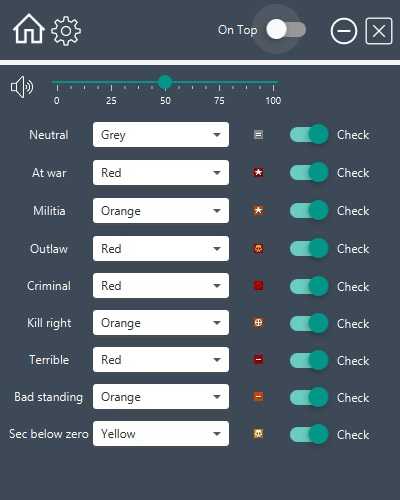
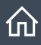
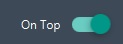
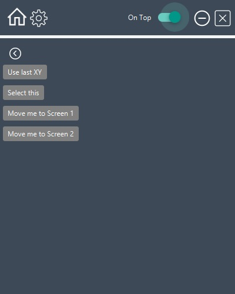

# EveRgency

Eve online local chat watcher. Creates screenshots from specific area and looking for hostile icons. It can alert if any hostile found.

#Features
* **safe**: does not inject into or write to the EVE Online client. 
* **dynamic & configurable** : standing icons for hostile detection are configurable. Icon colors same as in Eve online. 

## Requires
It is java program. Need JRE or JDK to run this Java application.

## Setup
[x.x.x] - latest version. Example: 1.0.0

1. Download and install JAVA (JRE or JDK)
2. Download the latest release at [Releases](https://github.com/rajmand/EveRgency/releases/)
3. Unzip EveRgency-[x.x.x].zip
4. Start EveRgency-[x.x.x].jar

## First time run
1 - Start EveRgency-[x.x.x].rar

You should see the program:

2 - Open the settings
Click to setting button:

3 - You should see the settings tab:

3.1 Choose an icon for hostile type in the dropdown menu
3.2 Change checking if you want for all hostile types
3.3 Change volume for alert sound

4 - Return to home tab

5 - Set "always on top"
If you turn on then the application will be always above from other windows

 6 - Start eve online
 7 - Open and set local chat channel. Channel always to be opened.
 
 8 - Click to [select area] button
 If you set already an area then you will see "Use last XY" if you haven't set before than you should set.
 
  
 
 9 - Choose screen by move screen button. **Don't move window by a mouse! Use move me button!**
 
 10 - If you see the application in right display than click to Select this.
 After clicked, you have to select the area by mouse left click. If you satisfied than hit than [ENTER]. If you want to exit then hit the [ESC].
 If you want to choose are than click somewhere else and start over.
 
 
 
 
 11 - Set precision
 The application will take multiple screenshots and analyzed them. The precision of the icon match can be modified by precision %.
 Suggested % between 95% and 98%. If you had any false alarm then you should change the precision %.  
 
 ## Additional features
 
 * Logging: log files will be created at **logs** folder
 * Configuration will saved at: **data\config.json**
 
 

